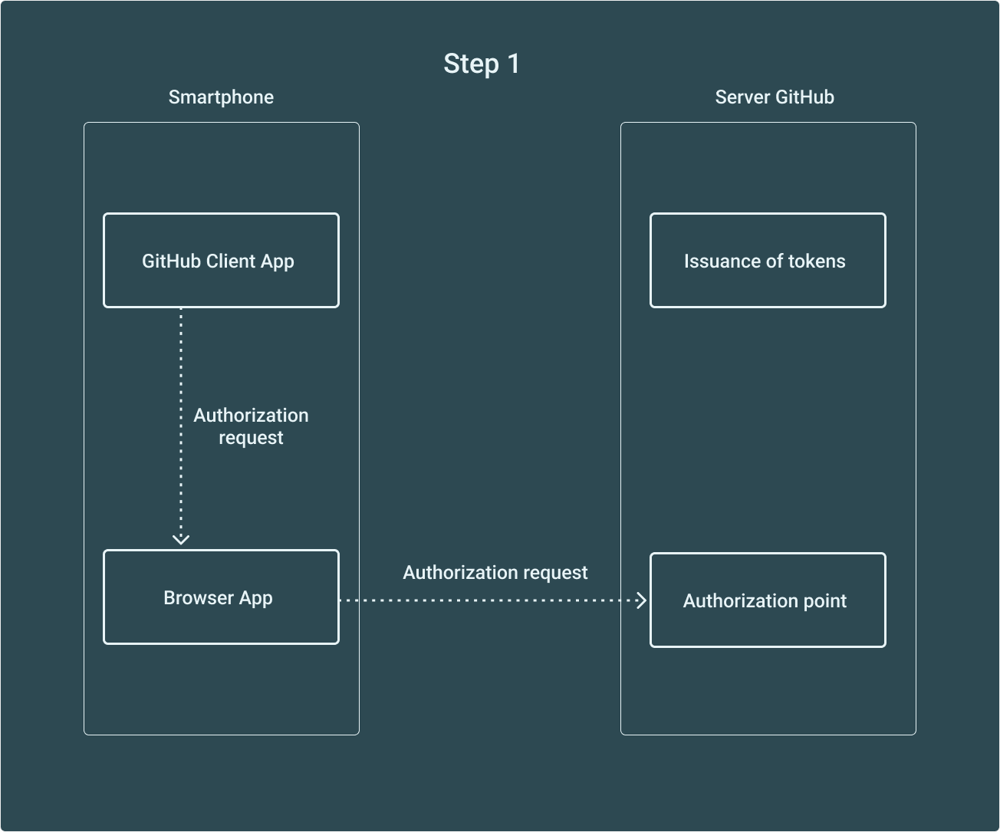

# GitHubClientApp
## Пример клиентского приложения [GitHub REST API](https://docs.github.com/en/rest) (https://docs.github.com/en/rest)
## Стек применяемых технологий:
1. Язык Kotlin
2. Библиотеки Retrofit, Glide, Gson
3. OAuth аутентификация и авторизация с помощью токена, Navigation Architecture Component, BottomNavigationView, настройки светлой/тёмной тем и выбора языка (русский, английский и китайский)
## Описание приложения:
Для экономии вычислительных ресурсов используется принцип одной активности и построение представления на фрагментах

<p align="left">

</p>
<p align="left">

</p>

В проекте отсутствует файл с персональными данными разработчика res/values/secret_properties.xml
\```
<?xml version="1.0" encoding="utf-8"?>
<resources>
    <string name="scheme" translatable="false">example_scheme</string>
    <string name="host" translatable="false">example_host</string>
    <string name="client_id" translatable="false">example_client_id</string>
    <string name="client_secret" translatable="false">example_client_secret</string>
    <string name="redirect_url" translatable="false">example_redirect_url</string>
</resources>
\```

scheme и host на основе [`<scheme>://<host>:<port><path><pathPrefix>`](https://developer.android.com/guide/topics/manifest/data-element) (https://developer.android.com/guide/topics/manifest/data-element)
client_id и client_secret назначаются при регистрации приложения OAuth App в [личном кабинете GitHub](https://github.com/settings/developers) (https://github.com/settings/developers)
redirect_url задаётся там же

OAuth аутентификацию и авторизацию с помощью токена можно описать следующей схемой:

<p align="left">

</p>
<p align="left">

</p>
<p align="left">

</p>

Мобильное приложение разработано в учебных/образовательных целях